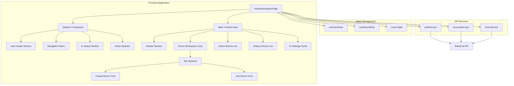

# Design Document: 创建/加入房间页面

## Overview

本设计文档描述了 X-Thread 协作平台「创建/加入房间」页面的技术设计方案。该页面是用户登录后的核心入口，提供创建新房间和加入现有房间的功能，同时展示用户的账号信息、AI 配置状态和房间列表。

页面采用现代 B 端工作台设计风格，使用紫色作为主色调，基于 React + TypeScript + Tailwind CSS + Zustand 技术栈实现。设计遵循组件化、可维护性和可扩展性原则。

## Architecture

### 系统架构图



### 技术栈

- **UI 框架**: React 18.3.0
- **类型系统**: TypeScript 5.5.0
- **状态管理**: Zustand 4.5.0
- **样式方案**: Tailwind CSS 3.4.0
- **路由管理**: React Router DOM 6.23.0
- **HTTP 客户端**: Axios 1.7.0
- **图标库**: Lucide React 0.400.0

### 架构原则

1. **组件化设计**: 将页面拆分为可复用的独立组件
2. **状态集中管理**: 使用 Zustand 管理全局状态（用户、房间）
3. **关注点分离**: UI 组件、业务逻辑、API 调用分离
4. **类型安全**: 全面使用 TypeScript 类型定义
5. **响应式设计**: 支持不同屏幕尺寸的自适应布局

## Components and Interfaces

### 组件层次结构

```
HomeWorkspacePage (主页面组件)
├── Sidebar (左侧导航栏)
│   ├── SidebarAvatar (用户头像区域)
│   ├── NavigationMenu (导航菜单)
│   ├── AIStatusModule (AI 状态模块)
│   └── ActionButtons (操作按钮组)
└── MainContentArea (主内容区域)
    ├── Header (页面头部)
    │   ├── Breadcrumb (面包屑导航)
    │   └── AccountWorkspaceBadge (账号工作台标识)
    └── DynamicContent (动态内容区)
        ├── RoomWorkspaceCard (创建/加入房间卡片)
        │   ├── TabSwitcher (选项卡切换器)
        │   ├── CreateRoomForm (创建房间表单)
        │   └── JoinRoomForm (加入房间表单)
        ├── ActiveRoomsList (活跃房间列表)
        ├── HistoryRoomsList (历史房间列表)
        └── AISettingsPanel (AI 设置面板)
```

### 核心组件接口

#### 1. HomeWorkspacePage

主页面组件，负责整体布局和状态管理。

```typescript
interface HomeWorkspacePageProps {}

interface HomeWorkspacePageState {
  // 选项卡状态
  roomTab: 'create' | 'join';
  activeSection: DashboardSection;
  
  // 表单数据
  roomForm: {
    topic: string;
    code: string;
    mode: 'ONSITE' | 'REMOTE';
    maxMembers: number;
  };
  
  // 账号数据
  overview: AccountOverview | null;
  
  // 加载状态
  roomBusy: boolean;
  overviewBusy: boolean;
  avatarBusy: boolean;
  accountBusy: boolean;
  
  // 错误和提示
  roomError: string;
  profileNotice: string;
  profileError: string;
}

type DashboardSection = 'rooms' | 'ai' | 'active' | 'history';
```

#### 2. SidebarAvatar

用户头像显示组件。

```typescript
interface SidebarAvatarProps {
  name?: string | null;
  avatar?: string | null;
  busy?: boolean;
}
```

#### 3. DashboardCard

通用卡片容器组件。

```typescript
interface DashboardCardProps {
  title: string;
  eyebrow?: string;
  description?: string;
  children: ReactNode;
  action?: ReactNode;
}
```

#### 4. NavigationItem

导航菜单项组件。

```typescript
interface NavigationItemProps {
  id: DashboardSection;
  label: string;
  icon: ComponentType<{ className?: string }>;
  count?: number;
  active: boolean;
  onClick: () => void;
}
```

### API 服务接口

#### accountService

```typescript
interface AccountService {
  getOverview(): Promise<AccountOverview>;
  updateProfile(payload: {
    nickname?: string;
    avatarDataUrl?: string;
    clearAvatar?: boolean;
  }): Promise<{ user: AccountProfile }>;
  cancelAccount(): Promise<{ ok: boolean }>;
  getAiSettings(): Promise<AiProviderSettings>;
  updateAiSettings(settings: AiProviderSettings): Promise<{ settings: AiProviderSettings }>;
}
```

#### roomService

```typescript
interface RoomService {
  createRoom(data: {
    topic: string;
    mode?: 'ONSITE' | 'REMOTE';
    maxMembers?: number;
  }): Promise<{ room: Room }>;
  joinRoom(code: string): Promise<{ room: Room }>;
  getRoom(id: string, options?: { history?: boolean }): Promise<Room>;
  getRoomByCode(code: string, options?: { history?: boolean }): Promise<Room>;
  leaveRoom(id: string): Promise<{ ok: boolean; leftAt: string }>;
  dissolveRoom(id: string): Promise<{
    ok: boolean;
    roomId: string;
    code: string;
    topic: string;
    dissolvedAt: string;
  }>;
}
```

## Data Models

### 前端数据模型

#### User (用户)

```typescript
interface User {
  id: string;           // 用户 ID
  name: string;         // 用户昵称
  account?: string | null;  // 账号标识
  email?: string | null;    // 邮箱地址
  avatar?: string | null;   // 头像 URL
  isGuest?: boolean;    // 是否为访客
}
```

#### Room (房间)

```typescript
type RoomMode = 'ONSITE' | 'REMOTE';
type RoomPhase = 'LOBBY' | 'ICEBREAK' | 'DISCUSS' | 'REVIEW' | 'CLOSED';

interface Room {
  id: string;           // 房间 ID
  code: string;         // 6 位房间码
  topic: string;        // 讨论主题
  mode: RoomMode;       // 房间模式
  phase: RoomPhase;     // 当前阶段
  maxMembers: number;   // 人数上限
  createdAt: string;    // 创建时间
  updatedAt?: string;   // 更新时间
  members?: RoomMember[]; // 成员列表
}
```

#### RoomMember (房间成员)

```typescript
interface RoomMember {
  userId: string;       // 用户 ID
  nickname: string;     // 昵称
  avatar?: string | null; // 头像
  role: 'OWNER' | 'MEMBER' | 'OBSERVER'; // 角色
  status: 'ACTIVE' | 'DISCONNECTED' | 'LEFT'; // 状态
  joinedAt?: string;    // 加入时间
  lastSeenAt?: string | null; // 最后在线时间
}
```

#### AccountOverview (账号概览)

```typescript
interface AccountOverview {
  user: AccountProfile;
  aiSettings: {
    provider: AiProvider;
    model: string;
    hasApiKey: boolean;
  };
  activeRooms: AccountOverviewRoom[];
  roomHistory: AccountOverviewRoom[];
}

interface AccountOverviewRoom {
  roomId: string;
  code: string;
  topic: string;
  phase: string;
  mode: 'ONSITE' | 'REMOTE';
  role: string;
  status: string;
  joinedAt: string;
  lastSeenAt: string;
  leftAt: string | null;
  memberCount: number;
  maxMembers: number;
  roomCreatedAt: string;
  roomUpdatedAt: string;
}
```

#### AiProviderSettings (AI 配置)

```typescript
type AiProvider = 'deepseek' | 'kimi' | 'qwen' | 'glm' | 'modelscope' | 'openai-compatible';

interface AiProviderSettings {
  provider: AiProvider;
  apiKey: string;
  baseUrl?: string;
  model?: string;
}
```

### 状态管理模型

#### UserStore (用户状态)

```typescript
interface UserStore {
  user: User | null;
  setUser: (user: User) => void;
  clearUser: () => void;
}
```

#### RoomStore (房间状态)

```typescript
interface RoomStore {
  currentRoom: Room | null;
  members: RoomMember[];
  setRoom: (room: Room) => void;
  setMembers: (members: RoomMember[]) => void;
  clearRoom: () => void;
}
```

## Error Handling

### 错误处理策略

1. **API 错误处理**
   - 捕获所有 API 调用异常
   - 提取后端返回的错误消息
   - 显示用户友好的错误提示
   - 记录错误日志（开发环境）

2. **表单验证错误**
   - 前端即时验证用户输入
   - 显示内联错误消息
   - 阻止无效数据提交

3. **网络错误处理**
   - 检测网络连接状态
   - 提供重试机制
   - 显示网络错误提示

4. **认证错误处理**
   - 检测 401/403 响应
   - 清除本地认证状态
   - 重定向到登录页面

### 错误处理实现

```typescript
// API 错误处理示例
const handleCreateRoom = async () => {
  if (!roomForm.topic.trim()) {
    setRoomError('请输入讨论主题');
    return;
  }

  setRoomBusy(true);
  setRoomError('');
  
  try {
    const result = await roomService.createRoom({
      topic: roomForm.topic.trim(),
      mode: roomForm.mode,
      maxMembers: roomForm.maxMembers,
    });
    setRoom(result.room);
    navigate(`/room/${result.room.code}/lobby`);
  } catch (error: any) {
    // 提取后端错误消息或使用默认消息
    const message = error?.response?.data?.message ?? '创建房间失败';
    setRoomError(message);
    console.error('Create room error:', error);
  } finally {
    setRoomBusy(false);
  }
};

// 认证错误处理
const refreshAccountData = async () => {
  if (!user?.id && !getStoredAuthToken()) {
    setOverview(null);
    return;
  }

  setOverviewBusy(true);
  try {
    const [nextOverview, nextAiSettings] = await Promise.all([
      accountService.getOverview(),
      accountService.getAiSettings(),
    ]);
    setOverview(nextOverview);
    syncUserFromProfile(nextOverview.user);
    saveAiSettings(nextAiSettings);
  } catch (error: any) {
    // 认证失败，清除会话
    clearAuthSession();
    clearRoom();
    setOverview(null);
    setAuthError(error?.response?.data?.message ?? '账号状态已失效，请重新登录');
  } finally {
    setOverviewBusy(false);
  }
};
```

### 错误消息显示

```typescript
// 错误消息组件
{roomError ? (
  <div className="mt-4 rounded-2xl border border-rose-200 bg-rose-50 px-4 py-3 text-sm text-rose-700">
    {roomError}
  </div>
) : null}

// 成功消息组件
{profileNotice ? (
  <div className="rounded-2xl border border-emerald-200 bg-emerald-50 px-4 py-3 text-sm text-emerald-700">
    {profileNotice}
  </div>
) : null}
```

## Testing Strategy

### 测试方法

本功能主要涉及 UI 渲染、用户交互和 API 集成，不适合使用 Property-Based Testing。测试策略采用以下方法：

1. **单元测试** (Unit Tests)
   - 测试工具函数（getInitials, formatTime, resolveRoomPathFromPhase）
   - 测试表单验证逻辑
   - 测试状态更新函数

2. **组件测试** (Component Tests)
   - 测试组件渲染
   - 测试用户交互（点击、输入）
   - 测试条件渲染逻辑

3. **集成测试** (Integration Tests)
   - 测试完整的用户流程（创建房间、加入房间）
   - 测试 API 调用和响应处理
   - 测试路由导航

4. **端到端测试** (E2E Tests)
   - 测试完整的用户场景
   - 测试跨页面交互
   - 测试错误恢复流程

### 测试用例示例

#### 单元测试

```typescript
describe('getInitials', () => {
  it('should return first two characters for single word', () => {
    expect(getInitials('Alice')).toBe('AL');
  });

  it('should return first character of first two words', () => {
    expect(getInitials('Alice Bob')).toBe('AB');
  });

  it('should return default "XT" for empty string', () => {
    expect(getInitials('')).toBe('XT');
  });
});

describe('formatTime', () => {
  it('should format date correctly', () => {
    const date = '2024-01-15T10:30:00Z';
    const result = formatTime(date);
    expect(result).toMatch(/\d+\/\d+\s+\d+:\d+/);
  });

  it('should return "暂无" for null', () => {
    expect(formatTime(null)).toBe('暂无');
  });
});
```

#### 组件测试

```typescript
describe('SidebarAvatar', () => {
  it('should render avatar image when provided', () => {
    const { getByAltText } = render(
      <SidebarAvatar name="Alice" avatar="https://example.com/avatar.jpg" />
    );
    expect(getByAltText('Alice')).toBeInTheDocument();
  });

  it('should render initials when no avatar', () => {
    const { getByText } = render(<SidebarAvatar name="Alice Bob" />);
    expect(getByText('AB')).toBeInTheDocument();
  });

  it('should show loading indicator when busy', () => {
    const { getByText } = render(<SidebarAvatar name="Alice" busy={true} />);
    expect(getByText('上传中')).toBeInTheDocument();
  });
});
```

#### 集成测试

```typescript
describe('Create Room Flow', () => {
  it('should create room and navigate to lobby', async () => {
    const mockCreateRoom = jest.fn().mockResolvedValue({
      room: { code: 'ABC123', topic: 'Test Topic', phase: 'LOBBY' }
    });
    
    const { getByPlaceholderText, getByText } = render(<HomeWorkspacePage />);
    
    // 输入主题
    const topicInput = getByPlaceholderText('例如：AI 如何改变工程协作');
    fireEvent.change(topicInput, { target: { value: 'Test Topic' } });
    
    // 点击创建按钮
    const createButton = getByText('创建并进入房间');
    fireEvent.click(createButton);
    
    // 验证 API 调用
    await waitFor(() => {
      expect(mockCreateRoom).toHaveBeenCalledWith({
        topic: 'Test Topic',
        mode: 'ONSITE',
        maxMembers: 8
      });
    });
    
    // 验证导航
    expect(mockNavigate).toHaveBeenCalledWith('/room/ABC123/lobby');
  });

  it('should show error when topic is empty', async () => {
    const { getByText } = render(<HomeWorkspacePage />);
    
    const createButton = getByText('创建并进入房间');
    fireEvent.click(createButton);
    
    await waitFor(() => {
      expect(getByText('请输入讨论主题')).toBeInTheDocument();
    });
  });
});
```

### 测试覆盖目标

- **单元测试覆盖率**: ≥ 80%
- **组件测试覆盖率**: ≥ 70%
- **集成测试覆盖率**: ≥ 60%
- **关键路径覆盖**: 100%（创建房间、加入房间、账号管理）

### 测试工具

- **测试框架**: Vitest
- **测试库**: React Testing Library
- **Mock 工具**: MSW (Mock Service Worker)
- **E2E 工具**: Playwright (可选)

