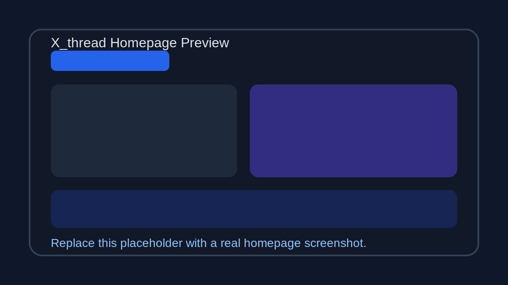
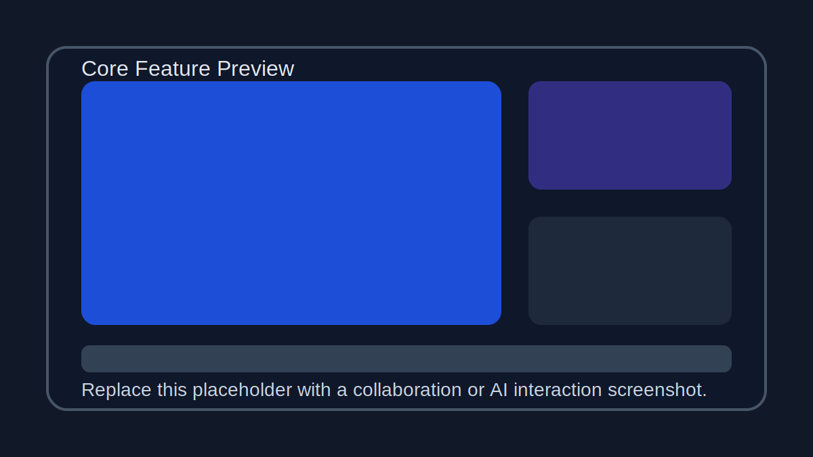
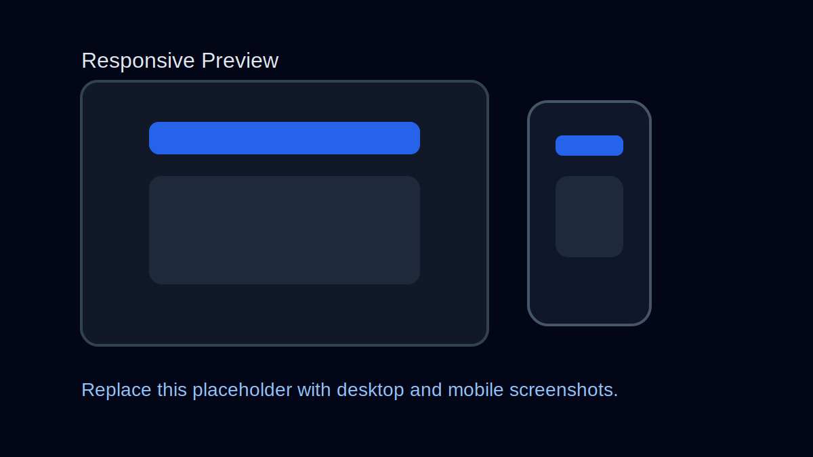

# X_thread
     
一款简洁美观的协作讨论平台，基于前后端全栈技术独立开发，支持线程讨论、交互协作及AI辅助功能。

## 项目预览
|  |  |  |
| :--: | :--: | :--: |

## 技术栈
### 技术说明
前端：HTML5、CSS3、JavaScript；后端：Node.js

## 功能介绍
- ✨ 支持用户登录与游客模式
- 📌 支持线程发布编辑删除
- ✨ 支持实时消息互动协作
- 📌 提供后端接口统一支撑
- ✨ 集成AI辅助讨论能力
- 📌 支持房间管理与阶段流转

## 本地运行步骤
### 1. 克隆仓库
```bash
git clone https://github.com/XJTLU-CPT208-B1-6/x-thread
cd x-thread
```

### 2. 后端启动
```bash
cd backend
pnpm install
pnpm dev
```

### 3. 前端启动
```bash
cd ../frontend
pnpm install
pnpm dev
```

## 项目亮点
- ✨ 独立完成前后端全流程开发
- 📌 采用前后端分离架构设计
- ✨ 代码分层清晰便于维护扩展
- 📌 功能贴合协作讨论真实场景

## 开源协议
采用MIT开源协议。
