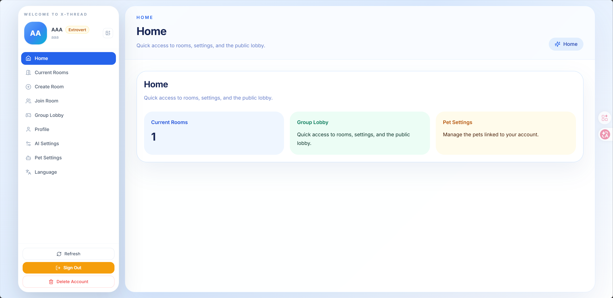
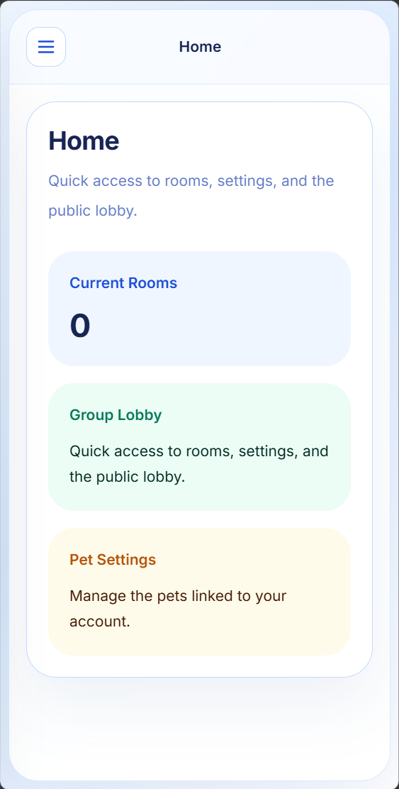
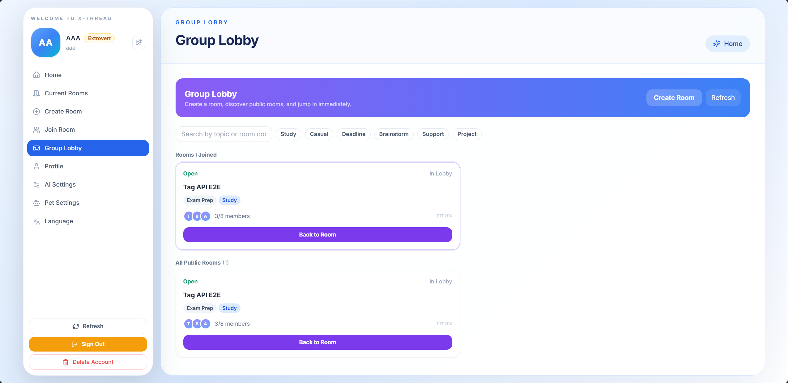
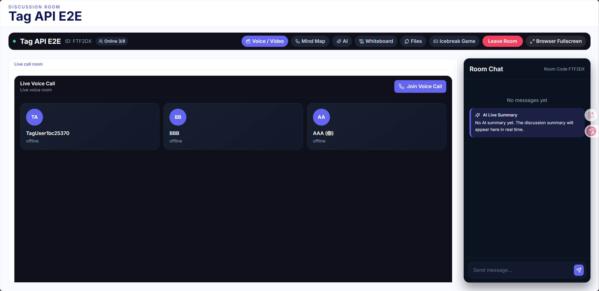

# X-Thread

西交利物浦大学小组讨论平台，围绕“房间讨论 + AI 辅助 + 实时协作”构建，支持多人协作、阶段化讨论、共享白板、思维导图与 AI 辅助分析。


> CPT208 Human-Centric Computing | Topic B1

## 快速导航

- [项目预览](#项目预览)
- [核心亮点](#核心亮点)
- [当前能力](#当前能力)
- [技术栈](#技术栈)
- [快速启动](#快速启动)
- [文档入口](#文档入口)

## 核心亮点

- 多人房间讨论与公开大厅并存，兼顾即时加入与组织协作
- 实时聊天、语音通话、思维导图、白板、文件共享一体化
- 接入多家 AI Provider，支持问答、摘要、导图生成与扩展
- 前后端分离架构清晰，适合课程展示、作品集与继续迭代

## 项目预览

> 首页、实时讨论、Group Lobby 与移动端响应式界面预览

| 项目首页展示 | 协作讨论 / AI 交互展示 |
|------|------|
|  |  |

| Group Lobby 展示 | 响应式效果展示 |
|------|------|
|  |  |

## 当前能力

- 房间流程：创建房间、公开大厅、加入房间、锁房、阶段切换、离开与解散。
- 实时协作：聊天、思维导图、文字白板、共享文件、房间状态同步。
- AI 能力：房间问答、白板摘要、思维导图生成/扩展/优化、可配置多家兼容模型。
- 账号能力：注册登录、资料编辑、AI 设置、默认与自定义 companion profiles。
- 远程互动：Socket.IO 实时同步，远程语音通话采用浏览器 WebRTC，服务端负责信令转发。
- 历史回看：聊天搜索、房间历史页、白板快照、思维导图大纲、共享文件历史下载。

## 技术栈

| Layer | Technology |
|------|------|
| Frontend | React 18, Vite 5, TypeScript, Tailwind CSS |
| State & Routing | Zustand, React Router v6 |
| Realtime | Socket.IO, browser WebRTC |
| Mind Map | `@xyflow/react` |
| Backend | NestJS, Fastify, TypeScript |
| Data | PostgreSQL 16, Prisma ORM |
| Infra in compose | PostgreSQL, Redis, MinIO |
| AI Providers | DeepSeek, Kimi, Qwen, GLM, ModelScope, custom OpenAI-compatible |
| File Persistence | 当前共享文件实现存储在 `backend/storage/` |

## 项目结构概览

```text
x-thread/
├── backend/      # NestJS + Prisma 后端
├── frontend/     # React + Vite 前端
├── docs/         # 项目文档与 README 资源
├── docker-compose.yml
├── package.json
└── pnpm-workspace.yaml
```

## 运行前提

- Node.js 20+
- pnpm 9+
- Docker Desktop / Docker Compose

## 常用脚本

在仓库根目录执行：

```bash
pnpm install
pnpm dev
pnpm dev:backend
pnpm dev:frontend
pnpm build:backend
pnpm build:frontend
```

说明：

- `pnpm dev` 会先检查 `backend/.env`，执行 Prisma migrate deploy，并在数据库未就绪时尝试 `docker compose up -d`。
- 前端默认运行在 `http://localhost:5173`。
- 后端默认运行在 `http://localhost:3001`，全局前缀为 `/api`。

## 快速启动

```bash
git clone https://github.com/XJTLU-CPT208-B1-6/x-thread
cd x-thread
pnpm install
```

创建后端环境文件：

```bash
copy .env.example backend\\.env
```

启动基础设施：

```bash
docker compose up -d
```

启动开发环境：

```bash
pnpm dev
```

首次运行时，如果 `backend/.env` 不存在，启动脚本会自动从根目录 `.env.example` 生成默认配置。

访问地址：

- Frontend: `http://localhost:5173`
- Backend API: `http://localhost:3001/api`
- MinIO Console: `http://localhost:9001`

## 当前目录结构

```text
x-thread/
├── backend/
│   ├── prisma/
│   │   ├── migrations/
│   │   └── schema.prisma
│   ├── scripts/
│   ├── storage/
│   └── src/
│       ├── common/
│       ├── gateways/
│       ├── modules/
│       │   ├── account/
│       │   ├── admin/
│       │   ├── ai/
│       │   ├── auth/
│       │   ├── chat/
│       │   ├── ingestion/
│       │   ├── mindmap/
│       │   ├── rooms/
│       │   ├── shared-files/
│       │   └── whiteboard/
│       ├── app.module.ts
│       └── main.ts
├── frontend/
│   ├── public/
│   └── src/
│       ├── components/
│       ├── hooks/
│       ├── lib/
│       ├── pages/
│       ├── services/
│       ├── stores/
│       ├── types/
│       ├── utils/
│       ├── App.tsx
│       └── main.tsx
├── docs/
│   ├── PROJECT_ORGANIZATION_REPORT.md
│   ├── QUICKSTART.md
│   ├── SETUP.md
│   └── SETUP_LOCAL.md
├── ai-logs/
├── docker-compose.yml
├── start-dev.js
├── start-dev.ps1
├── package.json
└── pnpm-workspace.yaml
```

## 文档入口

- [快速启动指南](docs/QUICKSTART.md)
- [本地环境配置](docs/SETUP.md)
- [无 Docker 本地配置](docs/SETUP_LOCAL.md)
- [项目整理报告](docs/PROJECT_ORGANIZATION_REPORT.md)

## 开发验证

```bash
corepack pnpm --filter x-thread-backend exec jest --runInBand
corepack pnpm --filter x-thread-frontend test
corepack pnpm --filter x-thread-backend build
corepack pnpm --filter x-thread-frontend build
```

## 备注

- `ai-logs/` 保留课程要求的 AI 使用记录。
- 根目录保留少量兼容文档入口，正式说明统一归档到 `docs/`。
